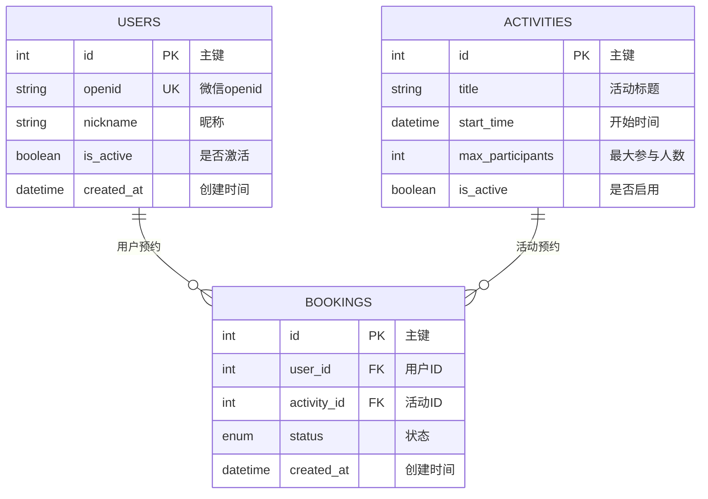

# 活动预约系统 - 后端架构文档

## 系统架构概览

### 分层架构设计

```
┌─────────────────────────────────────┐
│           API Layer                 │  ← FastAPI 路由层
│  (app/api/*.py)                     │
└─────────────────┬───────────────────┘
                  │
┌─────────────────▼───────────────────┐
│         Service Layer               │  ← 业务逻辑层
│  (app/services/*.py)                │
└─────────────────┬───────────────────┘
                  │
┌─────────────────▼───────────────────┐
│       Repository Layer              │  ← 数据访问层
│  (app/repositories/*.py)            │
└─────────────────┬───────────────────┘
                  │
┌─────────────────▼───────────────────┐
│         Model Layer                 │  ← 数据模型层
│  (app/models/*.py)                  │
└─────────────────────────────────────┘
```

## 目录结构

```
activity-booking-server/
├── app/
│   ├── api/                    # API 路由层
│   │   ├── activities.py       # 活动路由
│   │   ├── auth.py             # 认证路由
│   │   ├── bookings.py         # 预约路由
│   │   ├── deps.py             # 依赖注入
│   │   └── users.py            # 用户路由
│   │
│   ├── services/               # 业务逻辑层
│   │   ├── activity_service.py # 活动业务逻辑
│   │   ├── booking_service.py  # 预约业务逻辑
│   │   └── user_service.py     # 用户业务逻辑
│   │
│   ├── repositories/           # 数据访问层
│   │   ├── activity_repository.py # 活动数据访问
│   │   ├── base.py             # 基础 Repository 类
│   │   ├── booking_repository.py # 预约数据访问
│   │   └── user_repository.py  # 用户数据访问
│   │
│   ├── models/                 # 数据库模型层
│   │   ├── activity.py         # 活动模型
│   │   ├── booking.py          # 预约模型
│   │   └── user.py             # 用户模型
│   │
│   ├── schemas/                # 数据验证层
│   │   ├── response.py         # 统一响应格式
│   │   └── ...
│   │
│   └── utils/                  # 工具层
│       ├── response.py         # 响应工具函数
│       └── ...
```

## 各层职责

### 1. API 层 (app/api/)
**职责**: 处理 HTTP 请求和响应
- 路由定义和参数验证
- 调用 Service 层处理业务逻辑
- 统一响应格式处理
- 异常处理和错误响应

### 2. Service 层 (app/services/)
**职责**: 处理业务逻辑
- 业务规则验证
- 数据转换和处理
- 调用 Repository 层进行数据操作
- 事务管理

### 3. Repository 层 (app/repositories/)
**职责**: 处理数据访问
- 数据库查询封装
- 数据持久化操作
- 查询优化
- 缓存集成

### 4. Model 层 (app/models/)
**职责**: 定义数据结构
- 数据库表映射
- 字段类型定义
- 关系映射
- 约束定义

## 技术栈

### 后端框架
- **FastAPI** - 现代、快速的 Web 框架
- **SQLAlchemy 2.0** - 现代 ORM，使用 `Mapped` 注解
- **Pydantic** - 数据验证和序列化
- **Alembic** - 数据库迁移工具

### 数据库
- **PostgreSQL** - 主数据库
- **Redis** - 缓存和会话存储

### 开发工具
- **PyCharm** - IDE，支持完整的类型检查
- **mypy** - 静态类型检查
- **pytest** - 单元测试框架

## 统一 API 响应格式

### 响应结构
```python
class ApiResponse(BaseModel, Generic[T]):
    code: ResponseCode = ResponseCode.SUCCESS
    message: str = "操作成功"
    data: Optional[T] = None
    error: Optional[str] = None
    timestamp: int = int(datetime.now().timestamp())
```

### 状态码定义
```python
class ResponseCode(int, Enum):
    SUCCESS = 200
    CREATED = 201
    BAD_REQUEST = 400
    UNAUTHORIZED = 401
    FORBIDDEN = 403
    NOT_FOUND = 404
    CONFLICT = 409
    INTERNAL_ERROR = 500
    SERVICE_UNAVAILABLE = 503
```

## SQLAlchemy 2.0 最佳实践

### 模型定义
使用 `Mapped` 注解提供完整的类型信息：

```python
class Activity(Base):
    """活动模型"""
    __tablename__ = "activities"
    
    id: Mapped[int] = mapped_column(Integer, primary_key=True, index=True)
    title: Mapped[str] = mapped_column(String(200), nullable=False, comment="活动标题")
    description: Mapped[Optional[str]] = mapped_column(Text, comment="活动描述")
    # ... 其他字段
    
    # 关系
    bookings: Mapped[List["Booking"]] = relationship("Booking", back_populates="activity")
```

### 查询语法
使用 SQLAlchemy 2.0 的 `select()` 语法：

```python
# 推荐方式
query = select(Activity).where(Activity.is_active == True)
result = self.db.scalars(query).all()
return list(result)

# 计数查询
query = select(func.count()).select_from(Activity)
return self.db.scalar(query)
```

### 类型安全
- 使用 `TYPE_CHECKING` 避免循环导入
- 所有查询方法都有明确的返回类型
- IDE 能正确推断所有类型

## 数据模型关系

### ER 图


### 关系说明
- **用户** ↔ **预约** (1:N) - 一个用户可预约多个活动
- **活动** ↔ **预约** (1:N) - 一个活动可被多个用户预约
- **预约状态** - 枚举值控制预约流程

## 开发规范

### 代码风格
- 使用 Python 类型注解
- 遵循 PEP 8 代码规范
- 使用有意义的变量命名
- 添加适当的注释和文档字符串

### 错误处理
- 使用统一的异常处理机制
- 提供有意义的错误信息
- 记录详细的错误日志

### 测试策略
- 单元测试覆盖 Service 和 Repository 层
- 集成测试覆盖 API 层
- 使用 mock 对象隔离依赖

## 性能优化

### 数据库优化
- 合理使用索引
- 避免 N+1 查询问题
- 使用连接查询减少数据库访问

### 缓存策略
- Redis 缓存热点数据
- 查询结果缓存
- 会话数据缓存

### 查询优化
- 使用 `select()` 语法
- 合理使用 `join()` 和 `subquery()`
- 分页查询避免全表扫描

## 部署和运维

### 容器化
- 使用 Docker 容器化部署
- docker-compose 管理多服务
- 环境变量配置

### 监控和日志
- 结构化日志记录
- 性能监控
- 错误追踪

### 数据库迁移
- 使用 Alembic 管理数据库版本
- 自动化迁移脚本
- 回滚机制

## 总结

这个架构设计具有以下优势：

1. **职责清晰** - 每层都有明确的职责
2. **易于维护** - 代码结构清晰，易于理解和修改
3. **可扩展性强** - 可以轻松添加新功能
4. **类型安全** - 使用现代 Python 类型系统
5. **测试友好** - 各层可以独立测试
6. **性能优化** - 支持多种性能优化策略

通过这个架构，项目能够支持长期的发展和维护，同时保持代码的高质量和可读性。
