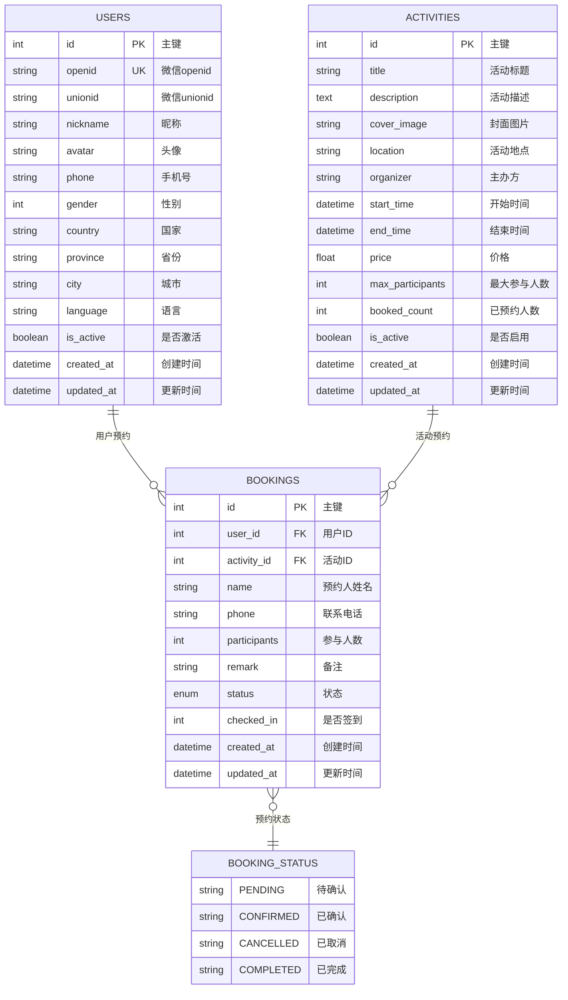

# 活动预约系统 - 数据库 ER 图

## 实体关系图

## 关系说明

### 1. 用户 (USERS) ↔ 预约 (BOOKINGS)
- **关系类型**: 一对多 (1:N)
- **外键**: `bookings.user_id` → `users.id`
- **说明**: 一个用户可以预约多个活动

### 2. 活动 (ACTIVITIES) ↔ 预约 (BOOKINGS)
- **关系类型**: 一对多 (1:N)
- **外键**: `bookings.activity_id` → `activities.id`
- **说明**: 一个活动可以被多个用户预约

### 3. 预约状态 (BOOKING_STATUS)
- **类型**: 枚举值
- **可选值**: 
  - `pending` - 待确认
  - `confirmed` - 已确认
  - `cancelled` - 已取消
  - `completed` - 已完成

## 数据库约束

### 主键约束
- `users.id` - 用户主键
- `activities.id` - 活动主键
- `bookings.id` - 预约主键

### 唯一约束
- `users.openid` - 微信openid唯一

### 外键约束
- `bookings.user_id` → `users.id`
- `bookings.activity_id` → `activities.id`

### 索引
- `users.openid` - 微信登录索引
- `users.unionid` - 微信unionid索引
- `activities.is_active` - 活动状态索引

## 业务规则

1. **用户管理**
   - 用户通过微信openid唯一标识
   - 支持微信unionid跨应用识别
   - 用户信息可选择性填写

2. **活动管理**
   - 活动有明确的时间范围
   - 支持设置最大参与人数限制
   - 实时统计已预约人数
   - 支持软删除（is_active字段）

3. **预约管理**
   - 预约需要用户和活动信息
   - 支持多人预约（participants字段）
   - 预约状态流转：待确认 → 已确认 → 已完成
   - 支持取消操作
   - 支持签到功能

## 数据完整性

- **参照完整性**: 外键约束确保数据一致性
- **域完整性**: 枚举类型限制状态值
- **实体完整性**: 主键约束确保记录唯一性
- **用户定义完整性**: 业务规则约束（如时间范围、人数限制等）
